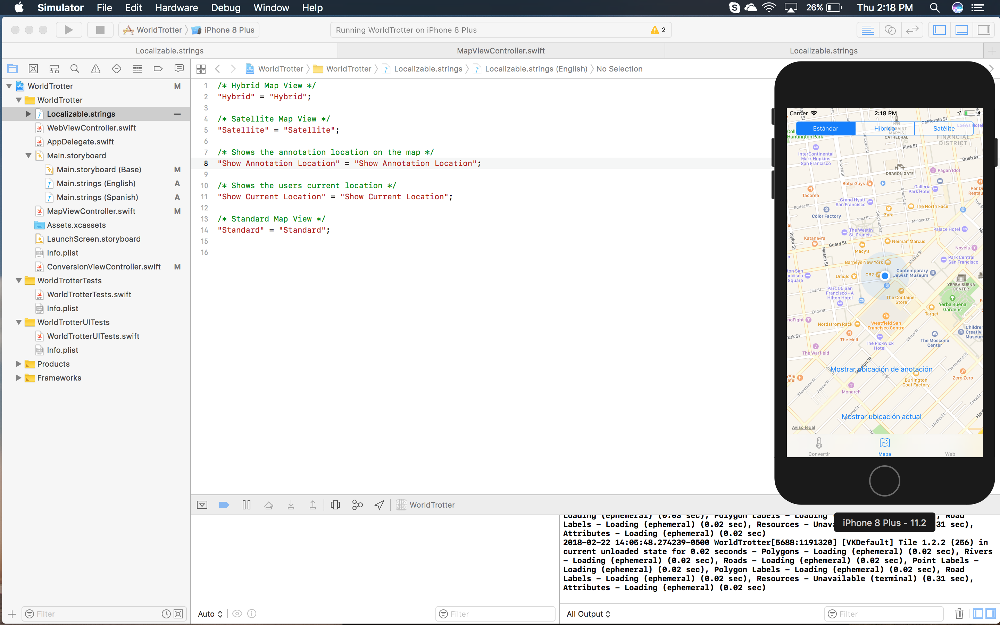
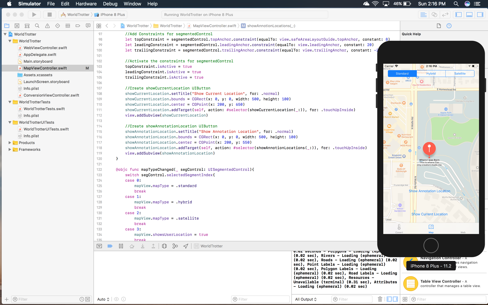
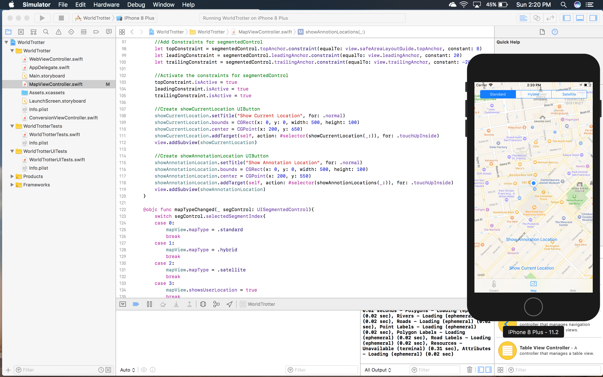
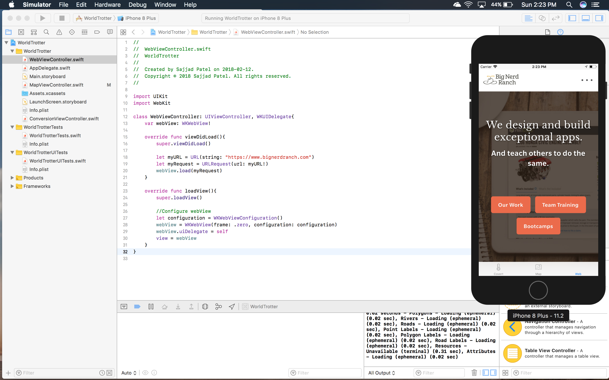
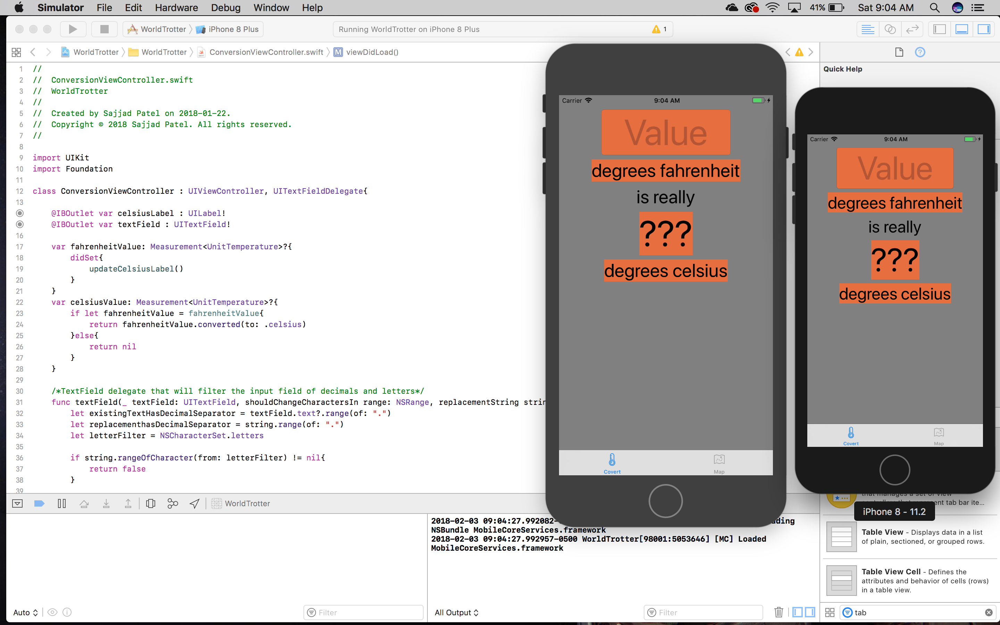
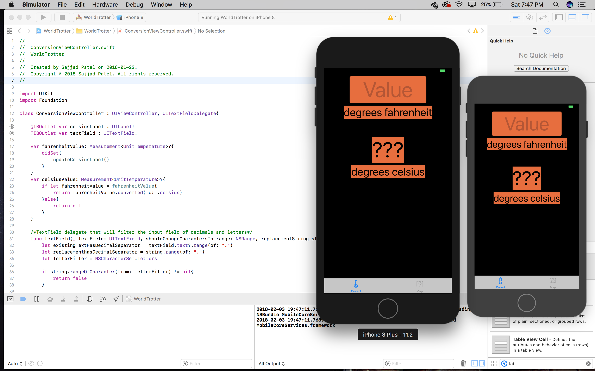
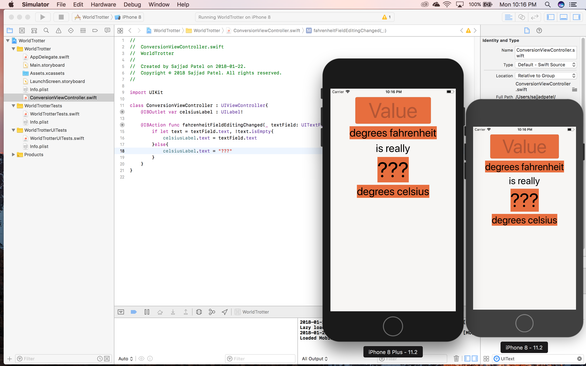

# WTAREADME

## Repo Description
Utilized Swift, Auto Constraint, UITextFieldDelegate, MapKit, UITabController and XCode to build an app for iOS devices that converts temperature from fahrenheit to celsius. The app takes advantage of MapKit allowing the user to zoom into their current location. It also uses annotations which shows places of interest.

## UPDATE 7
### Spanish Support

## UPDATE 6
### Gold Challenge

### Map Current Location

### Web Controller

## UPDATE 5
### Morning Background

### Evening/Night Background

# INITIAL 
## Auto Constraint Rendering App For IPhone 8 & 8 Plus

